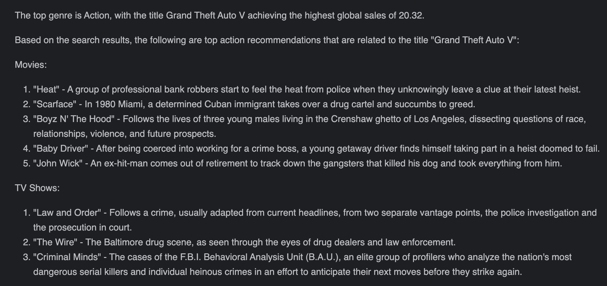

# 🤖 Corvic MCP with CrewAI

This tutorial demonstrates how to use Corvic's MCP protocol with CrewAI to analyze video game sales data, perform content research, and write results to a markdown file.

---

## 📘 Use Case

Using a Corvic-powered agent, CrewAI identifies the top game genre by global sales, searches for relevant content using Serper, and writes the results to a file using CrewAI's file writer tool.

---

## ✅ Prerequisites

1. Deploy a Corvic agent using the parquet version of the [video game sales dataset](https://www.kaggle.com/datasets/gregorut/videogamesales).
2. Configure your Python environment with:
   - `crewai`
   - `serper-dev-tool`
   - `corvic-mcp`
3. Obtain your Corvic MCP endpoint and token.

---

## 🧠 Question Asked

```text
Pass the following question to the tool as is (do not convert to SQL): Group all the data by Genre and find the top titles by global sales. Provide the top 1 genre in a tabular format.
```

## 📤 Response

The output written to `results_with_content.md` includes a tabular summary of the top genre by sales and curated content recommendations (e.g., related to Action and Grand Theft Auto V).



---

Need help? Contact [support@corvic.ai](mailto:support@corvic.ai) or visit [https://www.corvic.ai](https://www.corvic.ai).