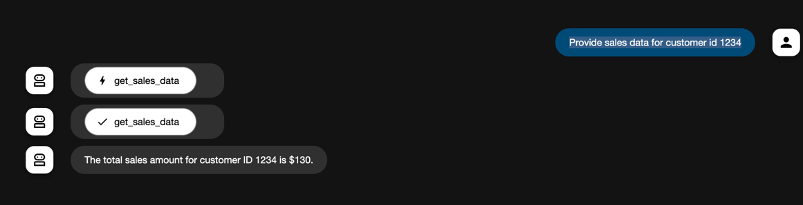

<h1> Corvic MCP with Google ADK</h1>
In this example, we use the ADK framework to forward a question to Corvic Agent via MCP. The Corvic agent is a sales reporting agent that reports the total sales given a customer id.
<h2>Pre-requisites</h2>
Download this folder to a local path and make sure you have the following libraries installed.

```bash

pip install google-adk   
pip install mcp  
pip install nest-asyncio
```

<h2>Setup Google Credentials</h2>
In the directory where the code is downloaded, set the Google credentials
```bash

export GOOGLE_GENAI_USE_VERTEXAI=FALSE
export GOOGLE_API_KEY=<YOUR GOOGLE API KEY>
```

<h2>Setup Corvic </h2>
Add MCP endpoint and Authorization in `agent.py`. Your administrator will provide these items

<h2>Start the ADK Server </h2>
Start the ADK web agent using the following command
```bash

adk web   
```

<h2>Ask questions on the Web Interface</h2>
Navigate to http://localhost:8000 where a prompt is presented. You can go ahead and ask the question you want Corvic to answer.

<p></p>
In the image above, a question `Provide sales data for customer id 1234` is being answered by Corvic.