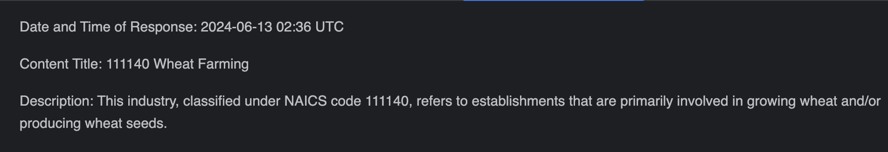

# 🧠 Corvic MCP with LangChain

This tutorial demonstrates how to use the LangChain framework with Corvic's MCP protocol to query an agent and save the result to a local file.

---

## 📘 Use Case

We ask the Corvic agent a structured question referencing the NAICS dataset and request the response be written to a file using LangChain's file management tools.

---

## ✅ Prerequisites

1. Deploy an agent on Corvic using the NAICS dataset.
2. Obtain your MCP endpoint and access token from the Corvic dashboard.
3. Set up LangChain with the necessary packages:
   - `langchain`
   - `langgraph`
   - `langchain-mcp-adapters`
   - `openai`
   - `mcp`

---

## 🧠 Question Asked

```text
As per NAICS codes, Describe wheat farming. Use tools to answer this question.
The answer should be written to a file named results.md
Write the date and time of the response in the file.
```

---

## 📤 Response

The agent uses Corvic to retrieve relevant information and the LangChain file management tool to write the answer (including timestamp) to `results.md`.


---

Need help? Contact [support@corvic.ai](mailto:support@corvic.ai) or visit [https://www.corvic.ai](https://www.corvic.ai).