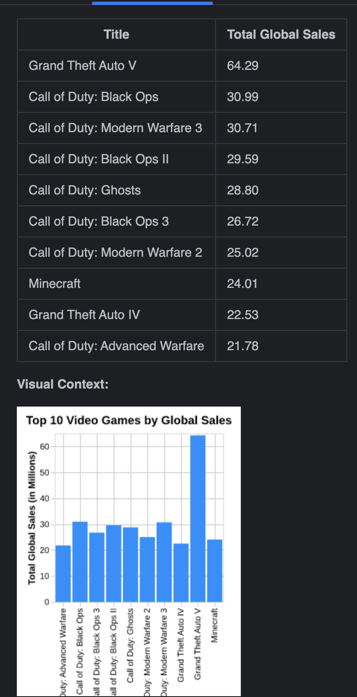

# 🎮 Corvic AI + OpenAI Integration: Structured Data Example

This example demonstrates how to integrate Corvic AI with an OpenAI agent framework to analyze structured data from a parquet file containing video game sales information.

---

## 📘 Use Case

In this tutorial, you'll upload a parquet file containing data about video game sales and ask Corvic to provide a report.

---

## ✅ Prerequisites

1. **Download the CSV Dataset**: Obtain the video game sales data from [Kaggle](https://www.kaggle.com/datasets/gregorut/videogamesales){:target="_blank"}.

2. **Convert CSV to Parquet**: Use Python to convert the CSV file to Parquet format:

   ```python
   import pandas as pd

   df = pd.read_csv("vgsales.csv")
   df.to_parquet("vgsales.parquet", index=False)
   ```

3. **Upload to Corvic**: Follow the documentation [here](https://frontend.corvic.dev/docs/howToUseCorvic/pipelines){:target="_blank"} to create an agent using this parquet file.

4. **Deploy the Agent**: Deploy the agent and obtain the MCP endpoint and access token.

---

## 🧠 Question Asked

```text
Provide the top performing titles as well as a bar chart in the output.
```

## 📤 Response

The Corvic agent will process the parquet data and return a report highlighting the top-performing video game titles, accompanied by a bar chart visualization.



---

## 📄 Notes

- Ensure that the `vgsales.parquet` file is correctly formatted and uploaded to the Corvic platform.
- Replace `<MCP_ENDPOINT>` and `<YOUR_CORVIC_API_TOKEN>` with your actual endpoint and token.
- The agent is instructed to use tools exclusively for answering queries.

---

Need help? Contact [support@corvic.ai](mailto:support@corvic.ai) or visit [https://www.corvic.ai](https://www.corvic.ai).