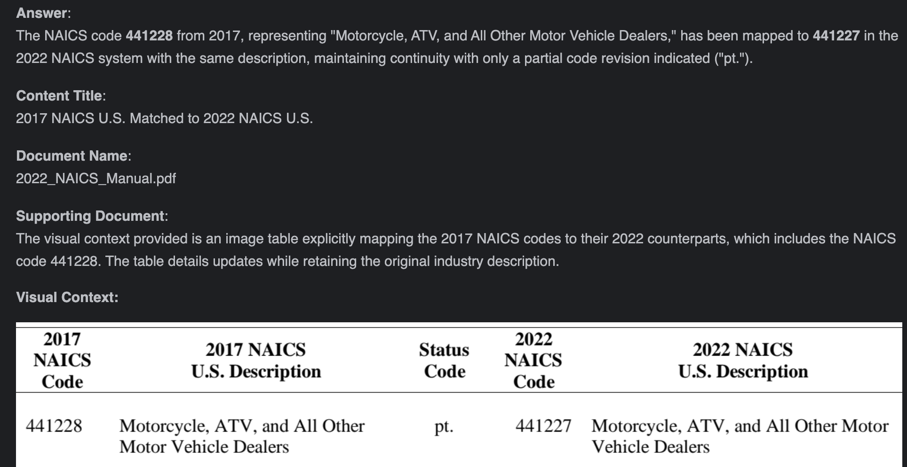

# 🐍 Corvic AI Python Integration Example

This example demonstrates how to use the Corvic AI MCP protocol in Python to query a deployed agent that processes PDF-based enterprise data.

---

## 📘 Use Case

We will ask a question that requires the Corvic agent to look up and reason through a NAICS (North American Industry Classification System) PDF document.

---

## ✅ Prerequisites

1. Complete the setup steps in this [blog post](https://corvic.substack.com/p/automating-address-updates-with-corvic?open=false#%C2%A7the-corvic-solution-automation-without-overhead).
2. Upload the [NAICS 2022 Manual PDF](https://www.census.gov/naics/reference_files_tools/2022_NAICS_Manual.pdf) and deploy your agent on Corvic’s platform.
3. Once deployed, copy the MCP endpoint and access token.

---

## 🧰 Integration Steps

1. Use the `mcp` Python package to create an `sse_client` connection to the deployed agent.
2. Pass the MCP endpoint and your API token in the request headers.
3. Initialize the session and retrieve the list of available tools (Corvic currently supports a single tool: `query`).
4. Call the `query` tool with your question via the `query_content` argument.
5. Save the response to a markdown file for review.

---

## 🧠 Question Asked

```text
Map the NAICS code 441228 from 2017 to the 2022 NAICS code.
```

## 📤 Response

The response will look as below. The mapping as well as the relevant section of the document is retrieved by the Corvic agent.



---

## 📄 Notes

- The `query_content` argument is **required**.
- Replace the placeholder token with your actual Corvic API token.
- You can save or manipulate the response as needed (e.g., convert to HTML, display in UI, etc).

---

Need help? Contact [support@corvic.ai](mailto:support@corvic.ai) or visit [https://www.corvic.ai](https://www.corvic.ai).
